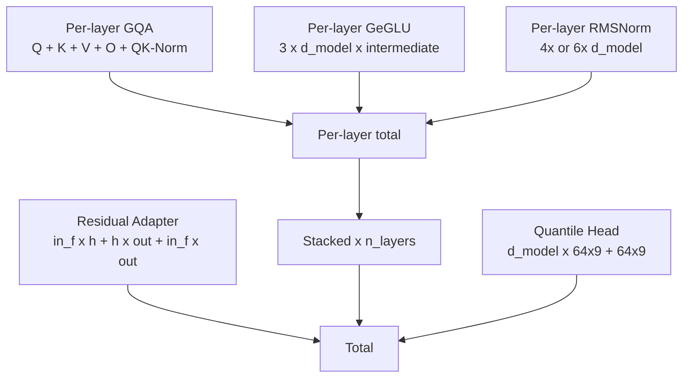
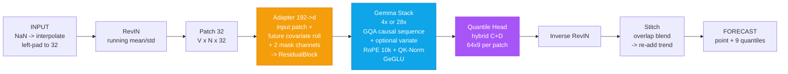
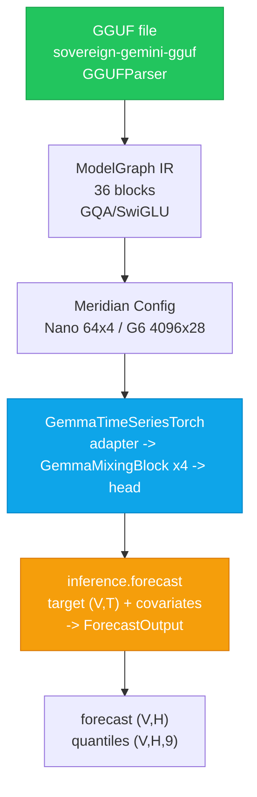

# Nano-Gemini

[](#license)
[](#param-count)
[](#hardware)
[](#quick-start)

> **Gemma decoder, time-series skin. 0.3M that runs on your 3080. Not Google TimesFM. No Google weights.**

Executable Nano-class time-series foundation model on a Gemma-3 backbone. G6 (6.15B) is spec only -- Nano (0.3M) is live.

Cherry-picked from `sovereign-gemini-gguf` + `ahmad-foundations`. Public, tri-licensed.

---

## What Is Nano?

**Nano is the executable contract. G6 is the blueprint.**

| | **Nano (live, this repo)** | **G6 (spec, not shipped)** |
|---|---|---|
| `d_model` | 64 | 4096 |
| Layers | 4 | 28 |
| GQA | 4 / 4 (MHA) | 32 / 8 (factor 4) |
| `head_dim` | 16 | 128 |
| GeGLU intermediate | 128 | 11008 |
| `input_patch_len` | 32 | 32 |
| `output_patch_len` | 64 | 64 |
| Quantiles | 9 (0.1-0.9) | 9 |
| **Params** | **~0.30M** | **6,157,679,744 (~6.15B)** |
| **Fits RTX 3080 10GB?** | **Yes** | **No (needs 24GB FP32 / 3GB Int4)** |

Gemma is not a time-series model. The **residual adapter** (`192 -> d_model`) is the only learned map from continuous patches into Gemma hidden space.

---

## Param Count -- How 0.3M and 6.15B Are Built

`src/model.py:1` + `src/config.py:1` -- exact accounting, no estimates:



| Component | Nano (64x4) | G6 (4096x28) |
|-----------|-------------|--------------|
| Sequence GQA / layer | 16,512 | 37,748,736 |
| Variate GQA / layer | 16,512 | 37,748,736 |
| GeGLU MLP / layer | 24,576 | 135,266,304 |
| RMSNorm / layer | 256 / 384 | 16,384 / 24,576 |
| **Per layer** | **~57k** | **~210M** |
| Stacked (x layers) | ~0.23M | ~5.88B |
| Residual adapter (192->) | ~8k | ~10M |
| Quantile head (64x9) | ~37k | ~2.36M |
| **Total** | **~0.30M** | **6,157,679,744** |

```python
from src.parameters import G6_PARAMS, NANO_PARAMS
print(G6_PARAMS.total)  # 6157679744
print(NANO_PARAMS.total)  # ~304k
for line in G6_PARAMS.lines:
    print(f"{line.name}: {line.count:,}")
```

---

## Method -- Gemma Is Not a Time-Series Model



**TimesFM-3 contract preserved:** patch 32, RevIN, per-patch quantile head, non-autoregressive decode, multivariate + past-only / past-future covariates. **Approximated:** GeGLU vs ReLU FFN, lookahead dim, alternating 1:1. **Never claimed:** training mixture, loss, optimizer -- marked UNKNOWN.

---

## Flow -- From GGUF Parse to Forecast



---

## Quick Start

```bash
git clone https://github.com/SNAPKITTYWEST/nano-gemini
cd nano-gemini
pip install -r requirements.txt  # torch, numpy

# Param count
python -c "from src.parameters import G6_PARAMS, NANO_PARAMS; print(f'Nano {NANO_PARAMS.total:,}  G6 {G6_PARAMS.total:,}')"

# Torch model (0.3M, fits 3080)
python -c "from src.model import GemmaTimeSeriesTorch; from src.config import NanoConfig; m=GemmaTimeSeriesTorch(NanoConfig); print(sum(p.numel() for p in m.parameters()))"

# Numpy reference forecast (no torch, no weights)
python -c "import numpy as np; from src.inference import forecast; print(forecast(np.random.randn(3,128), horizon=8).forecast.shape)"
# (3, 8)

# With covariates (TimesFM-3 contract)
python << 'PY'
import numpy as np
from src.inference import forecast
target = np.random.randn(3,128)          # (V, T)
past_only = np.random.randn(1,128)       # (C, T)
past_future = np.random.randn(2,136)     # (C, T+H)
out = forecast(target, horizon=8, past_only_covariates=past_only, past_future_covariates=past_future)
print(out.forecast.shape)   # (3, 8)
print(out.quantiles.shape)  # (3, 8, 9)
PY
```

---

## What a Nano Model Is

Nano is **not a downscaled G6**. It is a *contract-faithful miniature* that implements the exact same pipeline -- RevIN, patch 32, RoPE, GQA, GeGLU, quantile head, stitch -- at `d=64` so it runs **and trains** on consumer hardware:

| Resource | Nano (4x64) | G6 (28x4096) FP32 | G6 Int4 |
|----------|-------------|------------------|---------|
| Params | 0.3M | 6.15B | 6.15B |
| VRAM | ~0.01GB | ~24GB | ~3.02GB |
| RTX 3080 10GB | Yes - Fits + trains | No - OOM | Yes - Fits inference |
| Browser (WASM) | Yes | No | No |

Use Nano to **develop and test the pipeline**; swap `NanoConfig -> G6Config` when you have the weights and VRAM.

---

## Structure

```
src/config.py          # NanoConfig / G6Config, QUANTILES 0.1-0.9
src/model.py           # RMSNorm, GeGLU, GQA, GemmaMixingBlock, ResidualAdapter, GemmaTimeSeriesTorch
src/inference.py       # forecast() numpy reference, Acklam inv_cdf, RevIN, stitch
src/normalization.py   # linear_interpolate, revin
src/patches.py         # patch_series, stitch_patches, context_pad
src/validation.py      # shape contract for covariates
```

---

## License

Tri-licensed: **Sovereign Source License v1.0** (Bel Esprit d'Accord Trust, 2026-06-01) | **BSL-1.1** (Change Date 2030-06-01 -> Apache 2.0) | **AGPL-3.0**. See `LICENSE`.

Headers `SNAPKITTYWEST-PROPRIETARY-2026-001` preserved. No Google weights.

Contact: **Ahmad Ali Parr** <ahmedparr93@gmail.com> -- Bel Esprit D'Accord Trust

---

*The Gemma is the backbone. The adapter is the skin. The quantile head is the forecast.*
